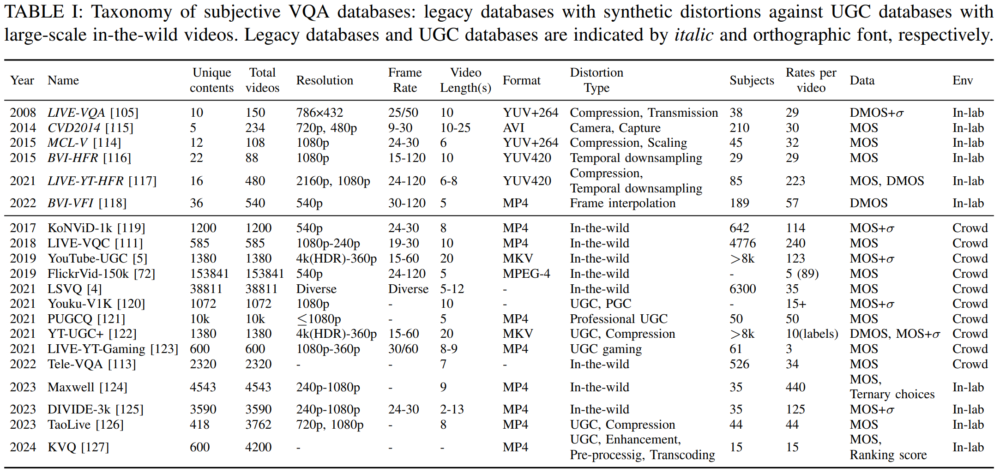
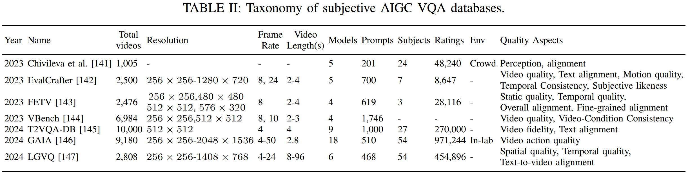

# Video-Quality-Assessment-A-Comprehensive-Survey
[](https://arxiv.org/abs/2412.04508)


> A collection of papers related to Video Quality Assessment (VQA).
> 
> The organization of papers refers to our survey [**"Video Quality Assessment: A Comprehensive Survey"**](https://arxiv.org/abs/2412.04508). We will continue to update **both [arxiv paper](https://arxiv.org/abs/2412.04508) and this repo** considering the fast development of this field.
>
> Please let us know if you have any suggestions by e-mail: qzheng21@m.fudan.edu.cn and tzz@tamu.edu.
>
> If you find our survey useful for your research, please cite the following paper:

```
@misc{zheng2024videoqualityassessmentcomprehensive,
      title={Video Quality Assessment: A Comprehensive Survey}, 
      author={Qi Zheng and Yibo Fan and Leilei Huang and Tianyu Zhu and Jiaming Liu and Zhijian Hao and Shuo Xing and Chia-Ju Chen and Xiongkuo Min and Alan C. Bovik and Zhengzhong Tu},
      year={2024},
      eprint={2412.04508},
      archivePrefix={arXiv},
      primaryClass={eess.IV},
      url={https://arxiv.org/abs/2412.04508}, 
}
```
## Table of Contents

- [Video-Quality-Assessment-A-Comprehensive-Survey](#video-quality-assessment-a-comprehensive-survey)
  - [Table of Contents](#table-of-contents)
  - [Taxonomy of Subjective and Objective Video Quality Assessment](#taxonomy-of-video-quality-assessment)
  - [Classification and Evolution of Objective Quality Assessment Models](#classification-and-evolution-of-objective-quality-assessment-models)
  - [Application Overview of Video Quality Assessment](#application-overview-of-video-quality-assessment)
  - [Video Quality Assessment Datasets](#video-quality-assessment-datasets)
    - [Legacy Datasets](#legacy-datasets)
    - [User-generated Content (UGC) Datasets](#user-generated-content-ugc-datasets)
    - [AI-generated Content (AIGC) Datasets](#ai-generated-content-aigc-datasets)
  - [Objective Video Quality Assessment Models](#objective-video-quality-assessment-models)
    - [Full-Reference Video Quality Assessment](#full-reference-video-quality-assessment)
      - [Knowledge-driven FR VQA methods](#1-knowledge-driven-fr-vqa-methods)
        - [Type i: Pixel-error-based](#type-i-pixel-error-based)
        - [Type ii: Structural Similarity-based VQA](#type-ii-structural-similarity-based-vqa)
        - [Type iii: Neurostatistics-based VQA](#type-iii-neurostatistics-based-vqa)
        - [Type iv: Feature fusion-based VQA](#type-iv-feature-fusion-based-vqa)
        - [Type v: Low-level motion feature-based VQA](#type-v-low-level-motion-feature-based-vqa)
      - [Deep Learning-Based FR IQA Methods](#2-deep-learning-based-fr-iqa-methods)
        - [Type i: Deep feature-based IQA](#type-i-deep-feature-based-iqa)
        - [Type ii: Feature pyramid-based IQA](#type-ii-feature-pyramid-based-iqa)
      - [Deep Learning Based FR VQA Methods](#3-deep-learning-based-fr-vqa-methods)
        - [Type i: Temporal pooling-based VQA](#type-i-temporal-pooling-based-vqa)
        - [Type ii: Temporal NN module-based VQA](#type-ii-temporal-nn-module-based-vqa)
    - [No-Reference Video Quality Assessment](#no-reference-video-quality-assessment)
      - [Knowledge-driven BVQA methods](#1-knowledge-driven-bvqa-methods)
        - [Type i: Low-level visual feature-based VQA](#type-i-low-level-visual-feature-based-vqa)
        - [Type ii: Neurostatistics-based VQA](#type-ii-neurostatistics-based-vqa)
      - [Deep Learning Based BIQA Methods](#2-deep-learning-based-biqa-methods)
        - [Type i: CNN feature extraction and FC fusion](#type-i-cnn-feature-extraction-and-fc-fusion)
        - [Type ii: CNN feature extraction and special fusion](#type-ii-cnn-feature-extraction-and-special-fusion)
        - [Type iii: Transformer-based IQA](#type-iii-transformer-based-iqa)
        - [Type iv: Multi-task learning](#type-iv-multi-task-learning)
        - [Type v: Unsupervised and self-supervised learning](#type-v-unsupervised-and-self-supervised-learning)
        - [Type vi: Large multimodality model-based IQA](#type-vi-large-multimodality-model-based-iqa)
      - [Deep Learning Based BVQA](#3-deep-learning-based-bvqa)
        - [Type i: 2D CNNs with simple score/feature averaging](#type-i-2d-cnns-with-simple-scorefeature-averaging)
        - [Type ii: 2D CNNs with temporal aggregation networks](#type-ii-2d-cnns-with-temporal-aggregation-networks)
        - [Type iii: 3D CNNs / Transformation](#type-iii-3d-cnns--transformation)
        - [Type iv: Transformer-based models](#type-iv-transformer-based-models)
        - [Type v: Large multimodality model-based VQA](#type-v-large-multimodality-model-based-vqa)


## Taxonomy of Subjective and Objective Video Quality Assessment


## Classification and Evolution of Objective Quality Assessment Models


## Application Overview of Video Quality Assessment


## Video Quality Assessment Datasets


### Legacy Datasets

LIVE-VQA: [Study of Subjective and Objective Quality Assessment of Video](https://ieeexplore.ieee.org/document/5404314)

CVD2014: [CVD2014—A Database for Evaluating No-Reference Video Quality Assessment Algorithms](https://ieeexplore.ieee.org/document/7464299)

MCL-V: [MCL-V: A streaming video quality assessment database](https://www.sciencedirect.com/science/article/abs/pii/S1047320315000425)

BVI-HFR: [A Study of High Frame Rate Video Formats](https://ieeexplore.ieee.org/document/8531714)

LIVE-YT-HFR: [Subjective and objective quality assessment of high frame rate videos](https://ieeexplore.ieee.org/document/9497087)

BVI-VFI: [BVI-VFI: A Video Quality Database for Video Frame Interpolation](https://ieeexplore.ieee.org/document/10304617)

### User-generated Content (UGC) Datasets

KoNViD-1k: [The Konstanz natural video database (KoNViD-1k)](https://ieeexplore.ieee.org/document/7965673)

LIVE-VQC: [Large-Scale Study of Perceptual Video Quality](https://ieeexplore.ieee.org/document/8463581)

YouTube-UGC: [YouTube UGC Dataset for Video Compression Research](https://ieeexplore.ieee.org/document/8901772)

FlickrVid-150k: [No-Reference Video Quality Assessment using Multi-Level Spatially Pooled Features](https://arxiv.org/abs/1912.07966v1)

LSVQ: [Patch-VQ: ‘Patching Up’ the Video Quality Problem](https://ieeexplore.ieee.org/document/9577503)

Youku-V1K: [Perceptual quality assessment of internet videos](https://dl.acm.org/doi/10.1145/3474085.3475486)

PUGCQ: [PUGCQ: A Large Scale Dataset for Quality Assessment of Professional User-Generated Content](https://dl.acm.org/doi/abs/10.1145/3474085.3475183)

YT-UGC+: [Rich features for perceptual quality assessment of UGC videos](https://ieeexplore.ieee.org/document/9578800)

LIVE-YT-Gaming: [Subjective and Objective Analysis of Streamed Gaming Videos](https://ieeexplore.ieee.org/document/10175560)

Tele-VQA: [Telepresence Video Quality Assessment](https://dl.acm.org/doi/abs/10.1007/978-3-031-19836-6_19)

Maxwell: [Towards Explainable In-the-Wild Video Quality Assessment: A Database and a Language-Prompted Approach](https://dl.acm.org/doi/10.1145/3581783.3611737)

DIVIDE-3k: [Exploring video quality assessment on user generated contents from aesthetic and technical perspectives](https://openaccess.thecvf.com/content/ICCV2023/html/Wu_Exploring_Video_Quality_Assessment_on_User_Generated_Contents_from_Aesthetic_ICCV_2023_paper.html)

TaoLive: [MD-VQA: Multi-Dimensional Quality Assessment for UGC Live Videos](https://openaccess.thecvf.com/content/CVPR2023/html/Zhang_MD-VQA_Multi-Dimensional_Quality_Assessment_for_UGC_Live_Videos_CVPR_2023_paper.html)

KVQ: [KVQ: Kwai video quality assessment for short-form videos](https://openaccess.thecvf.com/content/CVPR2024/html/Lu_KVQ_Kwai_Video_Quality_Assessment_for_Short-form_Videos_CVPR_2024_paper.html)

### AI-generated Content (AIGC) Datasets

Chivileva et al.: [Measuring the Quality of Text-to-Video Model Outputs: Metrics and Dataset](https://arxiv.org/abs/2309.08009)

EvalCrafter: [EvalCrafter: Benchmarking and Evaluating Large Video Generation Models](https://openaccess.thecvf.com/content/CVPR2024/html/Liu_EvalCrafter_Benchmarking_and_Evaluating_Large_Video_Generation_Models_CVPR_2024_paper.html)

FETV: [FETV: A Benchmark for Fine-Grained Evaluation of Open-Domain Text-to-Video Generation](https://proceedings.neurips.cc/paper_files/paper/2023/hash/c481049f7410f38e788f67c171c64ad5-Abstract-Datasets_and_Benchmarks.html)

VBench: [VBench: Comprehensive Benchmark Suite for Video Generative Models](https://openaccess.thecvf.com/content/CVPR2024/html/Huang_VBench_Comprehensive_Benchmark_Suite_for_Video_Generative_Models_CVPR_2024_paper.html)

T2VQA-DB: [Subjective-Aligned Dataset and Metric for Text-to-Video Quality Assessment](https://dl.acm.org/doi/abs/10.1145/3664647.3680868)

GAIA: [GAIA: Rethinking Action Quality Assessment for AI-Generated Videos](https://arxiv.org/abs/2406.06087)

LGVQ: [Benchmarking AIGC Video Quality Assessment: A Dataset and Unified Model](https://arxiv.org/abs/2407.21408)

## Objective Video Quality Assessment Models
### Full-Reference Video Quality Assessment
#### 1) Knowledge-driven FR VQA methods
##### Type i: Pixel-error-based 
MSE

PSNR

##### Type ii: Structural Similarity-based VQA
SSIM: [Image quality assessment: from error visibility to structural similarity](https://ieeexplore.ieee.org/document/1284395)

MS-SSIM: [Multiscale structural similarity for image quality assessment](https://ieeexplore.ieee.org/document/1292216)

CW-SSIM: [Complex Wavelet Structural Similarity: A New Image Similarity Index](https://ieeexplore.ieee.org/document/5109651)

IW-SSIM: [Information Content Weighting for Perceptual Image Quality Assessment](https://ieeexplore.ieee.org/document/5635337)

FSIM: [FSIM: A Feature Similarity Index for Image Quality Assessment](https://ieeexplore.ieee.org/document/5705575)

ESSIM: [Edge Strength Similarity for Image Quality Assessment](https://ieeexplore.ieee.org/document/6423791)

GMSD: [Gradient Magnitude Similarity Deviation: A Highly Efficient Perceptual Image Quality Index](https://ieeexplore.ieee.org/document/6678238)

Liu et al.: [Image Quality Assessment Based on Gradient Similarity](https://ieeexplore.ieee.org/abstract/document/6081939)

VSI: [VSI: A Visual Saliency-Induced Index for Perceptual Image Quality Assessment](https://ieeexplore.ieee.org/document/6873260)

Video SSIM: [Video quality assessment based on structural distortion measurement](https://www.sciencedirect.com/science/article/abs/pii/S0923596503000766)

Wang and Li: [Video quality assessment using a statistical model of human visual speed perception](https://opg.optica.org/josaa/abstract.cfm?uri=josaa-24-12-B61)

V-SSIM: [A structural similarity metric for video based on motion models](https://ieeexplore.ieee.org/abstract/document/4217218)

MC-SSIM: [Efficient Video Quality Assessment Along Temporal Trajectories](https://ieeexplore.ieee.org/abstract/document/5604290)

Manasa and Channappayya: [An Optical Flow-Based Full Reference Video Quality Assessment Algorithm](https://ieeexplore.ieee.org/document/7442861)

3D-SSIM: [3D-SSIM for video quality assessment](https://ieeexplore.ieee.org/abstract/document/6466936)

##### Type iii: Neurostatistics-based VQA

VIF: [Image information and visual quality](https://ieeexplore.ieee.org/abstract/document/1576816)

MAD: [Most apparent distortion: full-reference image quality assessment and the role of strategy](https://www.spiedigitallibrary.org/journals/journal-of-electronic-imaging/volume-19/issue-1/011006/Most-apparent-distortion--full-reference-image-quality-assessment-and/10.1117/1.3267105.short)

ST-RRED: [Video Quality Assessment by Reduced Reference Spatio-Temporal Entropic Differencing](https://ieeexplore.ieee.org/abstract/document/6279462)

ST-GREED: [ST-GREED: Space-Time Generalized Entropic Differences for Frame Rate Dependent Video Quality Prediction](https://ieeexplore.ieee.org/abstract/document/9524440)

##### Type iv: Feature fusion-based VQA

VMAF: [Toward a practical perceptual video quality metric](https://netflixtechblog.com/toward-a-practical-perceptual-video-quality-metric-653f208b9652?gi=2af05547e413)

ST-VMAF: [Spatiotemporal Feature Integration and Model Fusion for Full Reference Video Quality Assessment](https://ieeexplore.ieee.org/abstract/document/8453837)

E-VMAF: [Spatiotemporal Feature Integration and Model Fusion for Full Reference Video Quality Assessment](https://ieeexplore.ieee.org/abstract/document/8453837)

FUNQUE: [Funque: Fusion of Unified Quality Evaluators](https://ieeexplore.ieee.org/abstract/document/9897312)

FUNQUE+: [One Transform to Compute Them All: Efficient Fusion-Based Full-Reference Video Quality Assessment](https://ieeexplore.ieee.org/abstract/document/10375336)

##### Type v: Low-level motion feature-based VQA

MOVIE: [Motion Tuned Spatio-Temporal Quality Assessment of Natural Videos](https://ieeexplore.ieee.org/abstract/document/5290142)

ST-MAD: [A spatiotemporal most-apparent-distortion model for video quality assessment](https://ieeexplore.ieee.org/abstract/document/6116171) 

AFViQ: [Attention Driven Foveated Video Quality Assessment](https://ieeexplore.ieee.org/abstract/document/6648696)

VQM-VFD: [Temporal Video Quality Model Accounting for Variable Frame Delay Distortions](https://ieeexplore.ieee.org/abstract/document/6954510)

PVM: [A Perception-Based Hybrid Model for Video Quality Assessment](https://ieeexplore.ieee.org/abstract/document/7100892)

FRQM: [A frame rate dependent video quality metric based on temporal wavelet decomposition and spatiotemporal pooling](https://ieeexplore.ieee.org/abstract/document/8296291)

#### 2) Deep Learning-Based FR IQA Methods

##### Type i: Deep feature-based IQA

Bosse et al.: [Deep Neural Networks for No-Reference and Full-Reference Image Quality Assessment](https://ieeexplore.ieee.org/abstract/document/8063957)

DeepQA: [Deep Learning of Human Visual Sensitivity in Image Quality Assessment Framework](https://openaccess.thecvf.com/content_cvpr_2017/html/Kim_Deep_Learning_of_CVPR_2017_paper.html)

Ahn et al.: [Deep Learning-Based Distortion Sensitivity Prediction for Full-Reference Image Quality Assessment](https://openaccess.thecvf.com/content/CVPR2021W/NTIRE/html/Ahn_Deep_Learning-Based_Distortion_Sensitivity_Prediction_for_Full-Reference_Image_Quality_Assessment_CVPRW_2021_paper.html)

SAMScore: [SAMScore: A Semantic Structural Similarity Metric for Image Translation Evaluation](https://arxiv.org/abs/2305.15367)

SAM-IQA: [SAM-IQA: Can Segment Anything Boost Image Quality Assessment?](https://arxiv.org/abs/2307.04455)

##### Type ii: Feature pyramid-based IQA

LPIPS: [The Unreasonable Effectiveness of Deep Features as a Perceptual Metric](https://openaccess.thecvf.com/content_cvpr_2018/html/Zhang_The_Unreasonable_Effectiveness_CVPR_2018_paper.html)

E-LPIPS: [E-LPIPS: Robust Perceptual Image Similarity via Random Transformation Ensembles](https://arxiv.org/abs/1906.03973)

DeepWSD: [DeepWSD: Projecting Degradations in Perceptual Space to Wasserstein Distance in Deep Feature Space](https://dl.acm.org/doi/abs/10.1145/3503161.3548193)

Tariq et al.: [Why Are Deep Representations Good Perceptual Quality Features?](https://link.springer.com/chapter/10.1007/978-3-030-58542-6_27)

DISTS: [Image Quality Assessment: Unifying Structure and Texture Similarity](https://ieeexplore.ieee.org/abstract/document/9298952)

A-DISTS: [Locally Adaptive Structure and Texture Similarity for Image Quality Assessment](https://dl.acm.org/doi/abs/10.1145/3474085.3475419)

TOPIQ: [TOPIQ: A Top-Down Approach From Semantics to Distortions for Image Quality Assessment](https://ieeexplore.ieee.org/abstract/document/10478301)

#### 3) Deep Learning Based FR VQA Methods
##### Type i: Temporal pooling-based VQA

FloLPIPS: [FloLPIPS: A Bespoke Video Quality Metric for Frame Interpolation](https://ieeexplore.ieee.org/abstract/document/10018062)

C3DVQA: [C3DVQA: Full-Reference Video Quality Assessment with 3D Convolutional Neural Network](https://ieeexplore.ieee.org/abstract/document/9053031)

DeepVQA: [Deep Video Quality Assessor: From Spatio-temporal Visual Sensitivity to A Convolutional Neural Aggregation Network](https://openaccess.thecvf.com/content_ECCV_2018/html/Woojae_Kim_Deep_Video_Quality_ECCV_2018_paper.html)

Sun et al.: [Deep Learning Based Full-Reference and No-Reference Quality Assessment Models for Compressed UGC Videos](https://ieeexplore.ieee.org/abstract/document/9455999)


##### Type ii: Temporal NN module-based VQA

Chen et al.: [Deep Neural Networks for End-to-End Spatiotemporal Video Quality Prediction and Aggregation](https://ieeexplore.ieee.org/abstract/document/9428209)

DVQM-HT: [Deep VQA based on a Novel Hybrid Training Methodology](https://arxiv.org/abs/2202.08595v1)

STRA-VQA: [Video Quality Assessment for Spatio-Temporal Resolution Adaptive Coding](https://ieeexplore.ieee.org/abstract/document/10444627)


### No-Reference Video Quality Assessment
#### 1) Knowledge-driven BVQA methods
##### Type i: Low-level visual feature-based VQA

CPBDM: [A No-Reference Image Blur Metric Based on the Cumulative Probability of Blur Detection (CPBD)](https://ieeexplore.ieee.org/abstract/document/5739529)

LPCM: [Image Sharpness Assessment Based on Local Phase Coherence](https://ieeexplore.ieee.org/abstract/document/6476013)

NJQA: [No-Reference Quality Assessment of JPEG Images via a Quality Relevance Map](https://ieeexplore.ieee.org/abstract/document/6691937)

JPEG-NR: [No-reference perceptual quality assessment of JPEG compressed images](https://ieeexplore.ieee.org/abstract/document/1038064)

TLVQM: [Two-Level Approach for No-Reference Consumer Video Quality Assessment](https://ieeexplore.ieee.org/abstract/document/8742797)

CORNIA: [Unsupervised feature learning framework for no-reference image quality assessment](https://ieeexplore.ieee.org/abstract/document/6247789)

HOSA: [Blind Image Quality Assessment Based on High Order Statistics Aggregation](https://ieeexplore.ieee.org/abstract/document/7501619)

##### Type ii: Neurostatistics-based VQA

BRISQUE: [No-Reference Image Quality Assessment in the Spatial Domain](https://ieeexplore.ieee.org/abstract/document/6272356)

GM-LOG: [Blind Image Quality Assessment Using Joint Statistics of Gradient Magnitude and Laplacian Features](https://ieeexplore.ieee.org/abstract/document/6894197)

HIGRADE: [No-Reference Quality Assessment of Tone-Mapped HDR Pictures](https://ieeexplore.ieee.org/abstract/document/7885070)

FRIQUEE: [Perceptual quality prediction on authentically distorted images using a bag of features approach](https://jov.arvojournals.org/article.aspx?articleid=2599945)

V-BLIINDS: [Blind Prediction of Natural Video Quality](https://ieeexplore.ieee.org/abstract/document/6705673)

Li et al.: [Spatiotemporal Statistics for Video Quality Assessment](https://ieeexplore.ieee.org/abstract/document/7469872)

VIDEVAL: [UGC-VQA: Benchmarking Blind Video Quality Assessment for User Generated Content](https://ieeexplore.ieee.org/abstract/document/9405420)

STS-QA: [Blind Video Quality Assessment via Space-Time Slice Statistics](https://ieeexplore.ieee.org/abstract/document/9897565)

FAVER: [FAVER: Blind quality prediction of variable frame rate videos](https://www.sciencedirect.com/science/article/abs/pii/S092359652400002X)

NIQE: [Making a “Completely Blind” Image Quality Analyzer](https://ieeexplore.ieee.org/abstract/document/6353522)

IL-NIQE: [A Feature-Enriched Completely Blind Image Quality Evaluator](https://ieeexplore.ieee.org/abstract/document/7094273)

NPQI: [Blind Image Quality Assessment by Natural Scene Statistics and Perceptual Characteristics](https://dl.acm.org/doi/abs/10.1145/3414837)

SNP-NIQE: [Unsupervised Blind Image Quality Evaluation via Statistical Measurements of Structure, Naturalness, and Perception](https://ieeexplore.ieee.org/abstract/document/8648473)

VIIDEO: [A Completely Blind Video Integrity Oracle](https://ieeexplore.ieee.org/abstract/document/7332944)

STEM: [Completely Blind Quality Assessment of User Generated Video Content](https://ieeexplore.ieee.org/abstract/document/9633248)

TPQI: [Exploring the Effectiveness of Video Perceptual Representation in Blind Video Quality Assessment](https://dl.acm.org/doi/abs/10.1145/3503161.3547849)

SLEEQ: [A no-reference video quality predictor for compression and scaling artifacts](https://ieeexplore.ieee.org/abstract/document/8296922)

BPRI: [Blind Quality Assessment Based on Pseudo-Reference Image](https://ieeexplore.ieee.org/abstract/document/8241862)

VIQE: [A Completely Blind Video Quality Evaluator](https://ieeexplore.ieee.org/abstract/document/9921340)


#### 2) Deep Learning Based BIQA Methods

##### Type i: CNN feature extraction and FC fusion

Kang et al.: [Convolutional Neural Networks for No-Reference Image Quality Assessment](https://openaccess.thecvf.com/content_cvpr_2014/html/Kang_Convolutional_Neural_Networks_2014_CVPR_paper.html)

Bosse et al.: [A deep neural network for image quality assessment](https://ieeexplore.ieee.org/abstract/document/7533065)

MEON: [End-to-End Blind Image Quality Assessment Using Deep Neural Networks](https://ieeexplore.ieee.org/abstract/document/8110690)

NIMA: [NIMA: Neural Image Assessment](https://ieeexplore.ieee.org/abstract/document/8352823)

PQR: [A Probabilistic Quality Representation Approach to Deep Blind Image Quality Prediction](https://arxiv.org/abs/1708.08190)

DB-CNN: [Blind Image Quality Assessment Using a Deep Bilinear Convolutional Neural Network](https://ieeexplore.ieee.org/document/8576582)

PaQ-2-PiQ: [From Patches to Pictures (PaQ-2-PiQ): Mapping the Perceptual Space of Picture Quality](https://openaccess.thecvf.com/content_CVPR_2020/html/Ying_From_Patches_to_Pictures_PaQ-2-PiQ_Mapping_the_Perceptual_Space_of_CVPR_2020_paper.html)

Sun et al.: [Blind Quality Assessment for in-the-Wild Images via Hierarchical Feature Fusion and Iterative Mixed Database Training](https://ieeexplore.ieee.org/abstract/document/10109108)


##### Type ii: CNN feature extraction and special fusion

QCN: [Blind Image Quality Assessment Based on Geometric Order Learning](https://openaccess.thecvf.com/content/CVPR2024/html/Shin_Blind_Image_Quality_Assessment_Based_on_Geometric_Order_Learning_CVPR_2024_paper.html)

GraphIQA: [GraphIQA: Learning Distortion Graph Representations for Blind Image Quality Assessment](https://ieeexplore.ieee.org/abstract/document/9720138)

Gao et al.: [Image Quality Assessment: From Mean Opinion Score to Opinion Score Distribution](https://dl.acm.org/doi/abs/10.1145/3503161.3547872)

FPR: [Hallucinated-IQA: No-Reference Image Quality Assessment via Adversarial Learning](https://openaccess.thecvf.com/content_cvpr_2018/html/Lin_Hallucinated-IQA_No-Reference_Image_CVPR_2018_paper.html)

HIQA: [No-Reference Image Quality Assessment by Hallucinating Pristine Features](https://ieeexplore.ieee.org/abstract/document/9894272)

BIECON: [Fully Deep Blind Image Quality Predictor](https://ieeexplore.ieee.org/abstract/document/7782419)

##### Type iii: Transformer-based IQA

MUSIQ: [MUSIQ: Multi-Scale Image Quality Transformer](https://openaccess.thecvf.com/content/ICCV2021/html/Ke_MUSIQ_Multi-Scale_Image_Quality_Transformer_ICCV_2021_paper.html)

TRIQ: [Transformer For Image Quality Assessment](https://ieeexplore.ieee.org/abstract/document/9506075)

DEIQT: [Data-Efficient Image Quality Assessment with Attention-Panel Decoder](https://ojs.aaai.org/index.php/AAAI/article/view/25302)

TReS: [No-Reference Image Quality Assessment via Transformers, Relative Ranking, and Self-Consistency](https://openaccess.thecvf.com/content/WACV2022/html/Golestaneh_No-Reference_Image_Quality_Assessment_via_Transformers_Relative_Ranking_and_Self-Consistency_WACV_2022_paper.html)

MANIQA: [MANIQA: Multi-Dimension Attention Network for No-Reference Image Quality Assessment](https://openaccess.thecvf.com/content/CVPR2022W/NTIRE/html/Yang_MANIQA_Multi-Dimension_Attention_Network_for_No-Reference_Image_Quality_Assessment_CVPRW_2022_paper.html)

##### Type iv: Multi-task learning

Zhang et al.: [Continual Learning for Blind Image Quality Assessment](https://ieeexplore.ieee.org/abstract/document/9784904)

MetaIQA: [MetaIQA: Deep Meta-Learning for No-Reference Image Quality Assessment](https://openaccess.thecvf.com/content_CVPR_2020/html/Zhu_MetaIQA_Deep_Meta-Learning_for_No-Reference_Image_Quality_Assessment_CVPR_2020_paper.html)

Su et al.: [From Distortion Manifold to Perceptual Quality: a Data Efficient Blind Image Quality Assessment Approach](https://www.sciencedirect.com/science/article/abs/pii/S0031320322005271)

SLIF: [Forgetting to Remember: A Scalable Incremental Learning Framework for Cross-Task Blind Image Quality Assessment](https://ieeexplore.ieee.org/abstract/document/10036133)

Li et al.: [Continual Learning of Blind Image Quality Assessment with Channel Modulation Kernel](https://ieeexplore.ieee.org/abstract/document/10636288)

Wang et al.: [Deep Blind Image Quality Assessment Powered by Online Hard Example Mining](https://ieeexplore.ieee.org/abstract/document/10070789)

Zhang et al.: [Task-Specific Normalization for Continual Learning of Blind Image Quality Models](https://ieeexplore.ieee.org/abstract/document/10462930)

##### Type v:  Unsupervised and self-supervised learning

CONTRIQUE: [Image Quality Assessment Using Contrastive Learning](https://ieeexplore.ieee.org/abstract/document/9796010)

Shukla et al.: [Opinion Unaware Image Quality Assessment via Adversarial Convolutional Variational Autoencoder](https://openaccess.thecvf.com/content/WACV2024/html/Shukla_Opinion_Unaware_Image_Quality_Assessment_via_Adversarial_Convolutional_Variational_Autoencoder_WACV_2024_paper.html)

Re-IQA: [Re-IQA: Unsupervised Learning for Image Quality Assessment in the Wild](https://openaccess.thecvf.com/content/CVPR2023/html/Saha_Re-IQA_Unsupervised_Learning_for_Image_Quality_Assessment_in_the_Wild_CVPR_2023_paper.html)

Babu et al.: [No Reference Opinion Unaware Quality Assessment of Authentically Distorted Images](https://openaccess.thecvf.com/content/WACV2023/html/Babu_No_Reference_Opinion_Unaware_Quality_Assessment_of_Authentically_Distorted_Images_WACV_2023_paper.html)

ARNIQA: [ARNIQA: Learning Distortion Manifold for Image Quality Assessment](https://openaccess.thecvf.com/content/WACV2024/html/Agnolucci_ARNIQA_Learning_Distortion_Manifold_for_Image_Quality_Assessment_WACV_2024_paper.html)

Zhao et al: [Quality-Aware Pre-Trained Models for Blind Image Quality Assessment](https://openaccess.thecvf.com/content/CVPR2023/html/Zhao_Quality-Aware_Pre-Trained_Models_for_Blind_Image_Quality_Assessment_CVPR_2023_paper.html)


##### Type vi: Large multimodality model-based IQA

CLIP-IQA: [Exploring CLIP for Assessing the Look and Feel of Images](https://ojs.aaai.org/index.php/AAAI/article/view/25353)

CLIP-IQA+: [Exploring CLIP for Assessing the Look and Feel of Images](https://ojs.aaai.org/index.php/AAAI/article/view/25353)

LIQE: [Blind Image Quality Assessment via Vision-Language Correspondence: A Multitask Learning Perspective](https://openaccess.thecvf.com/content/CVPR2023/html/Zhang_Blind_Image_Quality_Assessment_via_Vision-Language_Correspondence_A_Multitask_Learning_CVPR_2023_paper.html)

TCDs: [Towards transparent deep image aesthetics assessment with tag-based content descriptors](https://ieeexplore.ieee.org/abstract/document/10235894)

Q-Bench: [Q-Bench: A Benchmark for General-Purpose Foundation Models on Low-level Vision](https://iclr.cc/virtual/2024/poster/19616)

Q-Instruct: [Q-Instruct: Improving Low-level Visual Abilities for Multi-modality Foundation Models](https://openaccess.thecvf.com/content/CVPR2024/html/Wu_Q-Instruct_Improving_Low-level_Visual_Abilities_for_Multi-modality_Foundation_Models_CVPR_2024_paper.html)

Q-Align: [Q-Align: Teaching LMMs for Visual Scoring via Discrete Text-Defined Levels](https://proceedings.mlr.press/v235/wu24ah.html)

Co-Instruct: [Towards Open-Ended Visual Quality Comparison](https://dl.acm.org/doi/10.1007/978-3-031-72646-0_21)

#### 3) Deep Learning Based BVQA 

##### Type i: 2D CNNs with simple score/feature averaging

Domonkos Varga: [No-Reference Video Quality Assessment Based on the Temporal Pooling of Deep Features](https://link.springer.com/article/10.1007/s11063-019-10036-6)

NAVE: [A No-Reference Autoencoder Video Quality Metric](https://ieeexplore.ieee.org/abstract/document/8803204)

CNN-TLVQM: [Blind Natural Video Quality Prediction via Statistical Temporal Features and Deep Spatial Features](https://dl.acm.org/doi/abs/10.1145/3394171.3413845)

SIONR: [Semantic Information Oriented No-Reference Video Quality Assessment](https://ieeexplore.ieee.org/document/9312450)

CenseoQoE: [A strong baseline for image and video quality assessment](https://arxiv.org/abs/2111.07104)

RAPIQUE: [RAPIQUE: Rapid and Accurate Video Quality Prediction of User Generated Content](https://ieeexplore.ieee.org/abstract/document/9463703)

SWDF-DF-VQA: [No-Reference Video Quality Assessment Using Multi-Pooled, Saliency Weighted Deep Features and Decision Fusion](https://www.mdpi.com/1424-8220/22/6/2209)

NR-VMAF: [No-Reference VMAF: A Deep Neural Network-Based Approach to Blind Video Quality Assessment](https://ieeexplore.ieee.org/abstract/document/10564175)

##### Type ii: 2D CNNs with temporal aggregation networks

MLSP-VQA: [No-Reference Video Quality Assessment using Multi-Level Spatially Pooled Features](https://arxiv.org/abs/1912.07966v1)

Varga et al.: [No-reference video quality assessment via pretrained CNN and LSTM networks](https://link.springer.com/article/10.1007/s11760-019-01510-8)

VSFA: [Quality Assessment of In-the-Wild Videos](https://dl.acm.org/doi/abs/10.1145/3343031.3351028)

MGQA: [Video Quality Assessment for Online Processing: From Spatial to Temporal Sampling](https://ieeexplore.ieee.org/abstract/document/10648736)

RIRNet: [RIRNet: Recurrent-In-Recurrent Network for Video Quality Assessment](https://dl.acm.org/doi/abs/10.1145/3394171.3413717)

STDAM: [Perceptual Quality Assessment of Internet Videos](https://dl.acm.org/doi/abs/10.1145/3474085.3475486)

MDTVSFA: [Unified Quality Assessment of in-the-Wild Videos with Mixed Datasets Training](https://link.springer.com/article/10.1007/s11263-020-01408-w)

AB-VQA: [Attention Based Network For No-Reference UGC Video Quality Assessment](https://ieeexplore.ieee.org/abstract/document/9506420)

Li et al.: [Study on no-reference video quality assessment method incorporating dual deep learning networks](https://link.springer.com/article/10.1007/s11042-022-13383-0)

GSTVQA: [Learning Generalized Spatial-Temporal Deep Feature Representation for No-Reference Video Quality Assessment](https://ieeexplore.ieee.org/abstract/document/9452150)

2BiVQA: [2BiVQA: Double Bi-LSTM-based Video Quality Assessment of UGC Videos](https://dl.acm.org/doi/10.1145/3632178)


##### Type iii: 3D CNNs / Transformation

SACONVA: [No-Reference Video Quality Assessment With 3D Shearlet Transform and Convolutional Neural Networks](https://ieeexplore.ieee.org/abstract/document/7103036)

V-MEON: [End-to-End Blind Quality Assessment of Compressed Videos Using Deep Neural Networks](https://dl.acm.org/doi/10.1145/3240508.3240643)

You et al.: [Deep Neural Networks for No-Reference Video Quality Assessment](https://ieeexplore.ieee.org/abstract/document/8803395)

Hou et al.: [No-reference video quality evaluation by a deep transfer CNN architecture](https://www.sciencedirect.com/science/article/abs/pii/S0923596520300059)

Patch-VQ: [Patch-VQ: 'Patching Up' the Video Quality Problem](https://openaccess.thecvf.com/content/CVPR2021/html/Ying_Patch-VQ_Patching_Up_the_Video_Quality_Problem_CVPR_2021_paper.html)

CoINVQ: [Rich Features for Perceptual Quality Assessment of UGC Videos](https://openaccess.thecvf.com/content/CVPR2021/html/Wang_Rich_Features_for_Perceptual_Quality_Assessment_of_UGC_Videos_CVPR_2021_paper.html?ref=https://githubhelp.com)

Sun et al.: [A Deep Learning based No-reference Quality Assessment Model for UGC Videos](https://dl.acm.org/doi/abs/10.1145/3503161.3548329)

Li et al.: [Blindly Assess Quality of In-the-Wild Videos via Quality-Aware Pre-Training and Motion Perception](https://ieeexplore.ieee.org/abstract/document/9748114)

MD-VQA: [MD-VQA: Multi-Dimensional Quality Assessment for UGC Live Videos](https://openaccess.thecvf.com/content/CVPR2023/html/Zhang_MD-VQA_Multi-Dimensional_Quality_Assessment_for_UGC_Live_Videos_CVPR_2023_paper.html)

UCDA: [Unsupervised Curriculum Domain Adaptation for No-Reference Video Quality Assessment](https://openaccess.thecvf.com/content/ICCV2021/html/Chen_Unsupervised_Curriculum_Domain_Adaptation_for_No-Reference_Video_Quality_Assessment_ICCV_2021_paper.html)

Shen et al.: [A Blind Video Quality Assessment Method via Spatiotemporal Pyramid Attention](https://ieeexplore.ieee.org/abstract/document/10375568)


##### Type iv: Transformer-based models

StarVQA: [Starvqa: Space-Time Attention for Video Quality Assessment](https://ieeexplore.ieee.org/abstract/document/9897881)

PHIQNet: [Long Short-term Convolutional Transformer for No-Reference Video Quality Assessment](https://dl.acm.org/doi/abs/10.1145/3474085.3475368)

DisCoVQA: [DisCoVQA: Temporal Distortion-Content Transformers for Video Quality Assessment](https://ieeexplore.ieee.org/abstract/document/10054487)

FAST-VQA: [FAST-VQA: Efficient End-to-End Video Quality Assessment with Fragment Sampling](https://link.springer.com/chapter/10.1007/978-3-031-20068-7_31)

SAMA: [Scaling and Masking: A New Paradigm of Data Sampling for Image and Video Quality Assessment](https://ojs.aaai.org/index.php/AAAI/article/view/28170)

DOVER: [Exploring Video Quality Assessment on User Generated Contents from Aesthetic and Technical Perspectives](https://openaccess.thecvf.com/content/ICCV2023/html/Wu_Exploring_Video_Quality_Assessment_on_User_Generated_Contents_from_Aesthetic_ICCV_2023_paper.html)

SSL-VQA: [Knowledge Guided Semi-supervised Learning for Quality Assessment of User Generated Videos](https://ojs.aaai.org/index.php/AAAI/article/view/28221)


##### Type v:  Large multimodality model-based VQA

PTM-VQA: [PTM-VQA: Efficient Video Quality Assessment Leveraging Diverse PreTrained Models from the Wild](https://openaccess.thecvf.com/content/CVPR2024/html/Yuan_PTM-VQA_Efficient_Video_Quality_Assessment_Leveraging_Diverse_PreTrained_Models_from_CVPR_2024_paper.html)

COVER: [COVER: A Comprehensive Video Quality Evaluator](https://openaccess.thecvf.com/content/CVPR2024W/AI4Streaming/html/He_COVER_A_Comprehensive_Video_Quality_Evaluator_CVPRW_2024_paper.html)

KSVQE: [KVQ: Kwai Video Quality Assessment for Short-form Videos](https://openaccess.thecvf.com/content/CVPR2024/html/Lu_KVQ_Kwai_Video_Quality_Assessment_for_Short-form_Videos_CVPR_2024_paper.html)

Wen et al.: [Modular Blind Video Quality Assessment](https://openaccess.thecvf.com/content/CVPR2024/html/Wen_Modular_Blind_Video_Quality_Assessment_CVPR_2024_paper.html)

BUONA-VISTA: [Exploring Opinion-unaware Video Quality Assessment with Semantic Affinity Criterion](https://arxiv.org/abs/2302.13269)

MaxVQA: [Towards Explainable In-the-Wild Video Quality Assessment: A Database and a Language-Prompted Approach](https://dl.acm.org/doi/10.1145/3581783.3611737)

ZE-FESG: [ZE-FESG: A Zero-Shot Feature Extraction Method Based on Semantic Guidance for No-Reference Video Quality Assessment](https://ieeexplore.ieee.org/document/10448422)

Q-Align: [Q-Align: Teaching LMMs for Visual Scoring via Discrete Text-Defined Levels](https://proceedings.mlr.press/v235/wu24ah.html)

LMM-VQA: [LMM-VQA: Advancing Video Quality Assessment with Large Multimodal Models](https://arxiv.org/abs/2408.14008)
